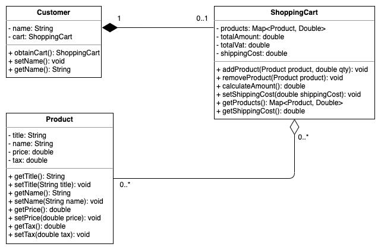

# Simple Shopping Cart
Simple shopping cart using Java SE

## UML Class Diagram



## How to run application

### 1. Local machine

#### Prerequisites

- Java 11
- Maven 3.5

#### Steps should be followed
1. Run maven clean installation command.
```
$  mvn clean install
```

2. Run the created shaded jar using following command.
```
$ java -jar target/shopping-cart-1.0-SNAPSHOT-shaded.jar
```

### 2. Docker image

1. Run Docker build command inside project directory
```
$ docker build -t shopping-cart .
```

2. If Docker build is succeeded, use `docker images` command and check whether your image is available in the local docker engine.
```
REPOSITORY                                 TAG                                 IMAGE ID            CREATED             SIZE
shopping-cart                              latest                              5751fce8d9e6        45 seconds ago      83.5MB
```

3. Docker run
```
$ docker run -i shopping-cart
```